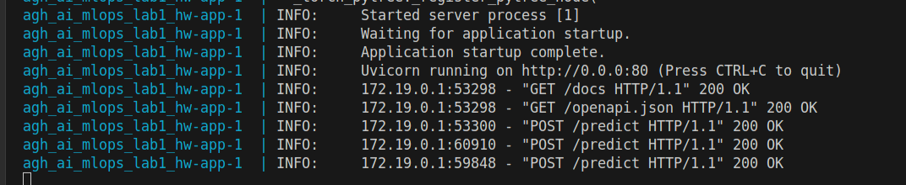

# Test

```
$ curl -X 'POST' \
  'http://localhost:8000/predict' \
  -H 'accept: application/json' \
  -H 'Content-Type: application/json' \
  -d '{
  "text": "Could be better"
}'


{"prediction":"negative"}
```

Dockerfile log

